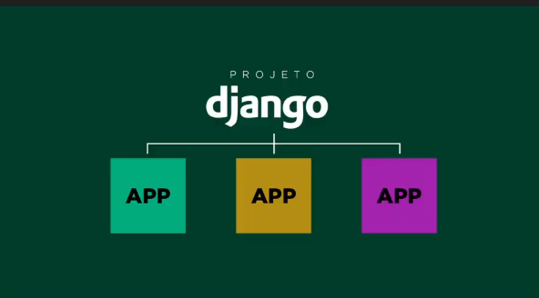
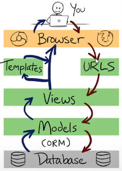

# passos 

## Passos parar  criação de aplicação Django

- criar pasta
- criar e ativar ambiente virtual
- inicializar git e gitignore
- instalar django `pip install django`
- verificar se django foi instalado com sucesso: `django-admin --version`
- criar projeto django `django-admin start app .`
- rodar servidor `python manage.py runserver`

### Apps em  django

Ao usar  o comando `django-admin start app .`, estamos criando o aplicativo principal, a base e coração do projeto. 

A  criação de  novos apps se dá com base na divisão lógica e responsabilidade do projeto, onde cada app fica responsável por apenas uma única responsabilidade.

A criação de um novo app se dá pelo comando `python manage.py startapp nome-do-app`.

Ao criar um novo app, o mesmo deve ser declarado no app principal, no arquivo `settings` em `installed_apps`

### Entendendo os arquivos iniciais

Na raíz:

- manage.py: gerenciador do projeto
- db.sqlite3: banco de dados de desenvolvimento para teste.

No app principal:

- settings.py: todas as configurações do projeto (apps instalados,  connnfiguração de banco de dados entre outras)
- urls.py: as rotas do projeto
- asgi e wsgi: quando colocar aplicação em produção, configura aplication server.

Outros apps

- test.py: testes unitários, integração, unittest, pytest, selenium
- apps.py: configuração do app atual
- models.py: modelos, tabelas de banco de dados
- views.py: todas as views (lógica da aplicação)
- admin.py: admin do django

### Inicializar  banco de dados

1 - Rastreia arquivos em busca de mudanças:
`python manage.py makemigrations`

2 - Executa de fato:
`python manage.py migrate`

Sempre que alterar algo no banco de dados,  execute os passos 1 e 2.

### Criar usuário administrador django (super usuário)

Antes de criar o usuário administrador, inicialize o banco de dados.

`python manage.py createsuperuser`

Defina o usuário, email e senha.

### Camadas Urls, views e templates

#### Visão do usuário versus visão do admin

Usuários e administradores visualizam o sistema de modos diferentes.

admin faz a gestão do conteúdo do site.
